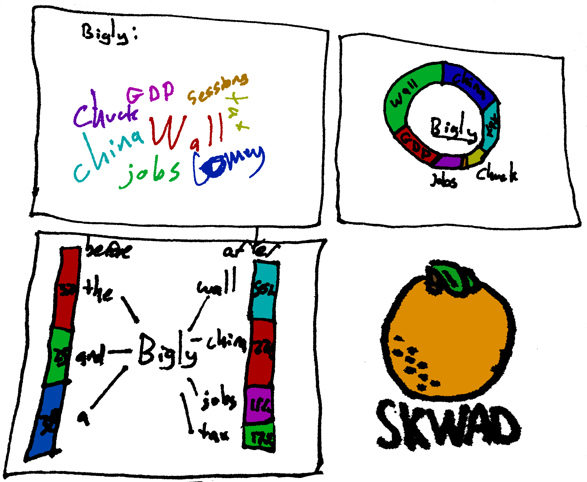

# orange_skwad
They're not oranges... they're blood oranges.
# Jiayang Chen, Vincent Chi, Ray Onishi, Theodore Peters
P #04: Viz not to be confused with vis or vis-a-vis

## Project Description
Source: [Trump's Tweet Archives](http://www.trumptwitterarchive.com/)
This dataset contains a list of Donald Trump's 10000+ Tweets, including categorization and word count.
Our plan is to use these word counts to make a wordmap and create an interaction where clicking a word grants you the wordmap for the possible words that come after the word you selected.

## How We Aim to Make This Data Alive
There are several iconic "Trump" phrases, but what does he really say? 
When the words displayed on the wordmap are clicked, a new wordmap will be generated and the new words will be sized according to the probability of appearing after the clicked word. i.e If the user clicks on "big", the largest word in the new wordmap might be "wall". By allowing users to take their own path, they can explore their own questions about Donald Trump's speech like the expanse of his vocabulary. Perhaps, the users can create their own sentences trying to mimick Trump.
## D3 Feature Utilization
Our project will have similarity to the [Word Cloud](https://www.jasondavies.com/wordcloud/) example in the gallery as we will be building a similar wordmap using Trump's tweets, using the same idea of utilizing word count to determine the size of each word in the map. 

D3 has a [word cloud data structure](http://bl.ocks.org/joews/9697914) which we can use and manipulate to display the word cloud. We can edit the font, size, color of words. We can also directly access the svg elements for each word, so we can add event listeners "on click" to update the word cloud.

## Sketch-up of Envisioned Visualization



## Launch Code
1. Clone Repo:
    ```
    $ git clone https://github.com/vchi90/orange_skwad.git
    ```
    
2. Create and activate your virtual environment in the terminal.
    ```
    $ python3 -m venv <<placeholder>>
    $ . <<PATH_TO_VENV>>/bin/activate
    ```

4. Install the dependencies with [requirements.txt](requirements.txt) by running the following command  
    ```
    pip install -r requirements.txt
    ```
    
5. Go into the repo (```cd orange_sqwad```) and run the python file by typing ```$ python app.py``` in the terminal.

6. Open your web browser and open localhost:5000

To terminate (in terminal), CTRL + C. To exit virtual environment, deactivate.
